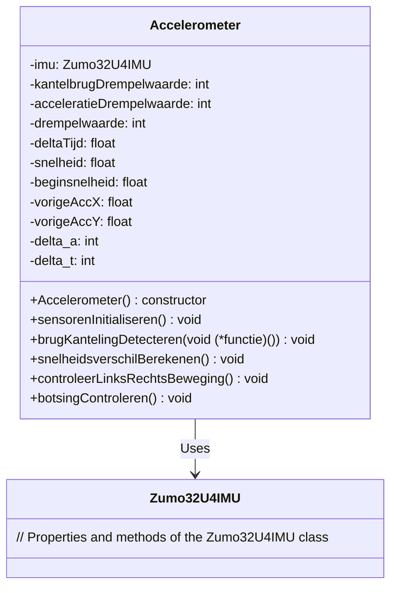

```mermaid
classDiagram
    class Accelerometer {
        +Accelerometer() constructor
        +sensorenInitialiseren() void
        +brugKantelingDetecteren(void (*functie)()) void
        +snelheidsverschilBerekenen() void
        +controleerLinksRechtsBeweging() void
        +botsingControleren() void
        -imu: Zumo32U4IMU 
        -kantelbrugDrempelwaarde: int
        -acceleratieDrempelwaarde: int
        -drempelwaarde: int
        -deltaTijd: float
        -snelheid: float
        -beginsnelheid: float
        -vorigeAccX: float
        -vorigeAccY: float
        -delta_a: int
        -delta_t: int
    }
    class Zumo32U4IMU {
        // Properties and methods of the Zumo32U4IMU class
    }

    Accelerometer --> Zumo32U4IMU : Uses

```